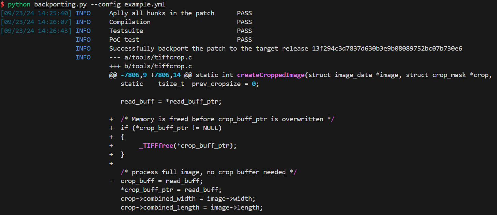

[](./Setup_and_Usage.md)

# 构建、使用文档

## 一、构建方法

### 代码仓说明

本项目共有两个代码仓：

`patch_dataset`：包含真实世界中收集的 100 个 C/CPP 与 50 个 Golang CVE 补丁 backport 迁移失败案例。为每个项目的每个 CVE 单独准备数据，其中包含失败信息，编译脚本，testsuite 脚本(部分)，PoC 脚本(部分)。

`patch-backporting`：项目源码，其中包含与大模型交互代理及工具。

### 源码目录结构

```text
.
├── README.md
├── logs
├── pdm.lock
├── pyproject.toml
├── requirements.txt
├── src
│   ├── agent
│   │   ├── __init__.py
│   │   ├── invoke_llm.py
│   │   └── prompt.py
│   ├── backporting.py
│   ├── check
│   │   ├── __init__.py
│   │   └── usage.py
│   ├── example.yml
│   └── tools
│       ├── __init__.py
│       ├── logger.py
│       ├── project.py
│       └── utils.py
└── test
    ├── test_hunk.py
    └── test_patch.py
```

### 软件依赖

- Python >= 3.10
- Ctags 5.9.0 `sudo apt install universal-ctags`
- PDM 2.18.2 <https://github.com/pdm-project/pdm>

### 依赖配置方法

1. 安装 PDM

   ```bash
   curl -sSL https://pdm-project.org/install-pdm.py | python3 -
   ```

2. 配置 Python 及其依赖

   ```bash
   # 在 patch-backporting 路径下
   $ pdm install
   $ source .venv/bin/activate
   ```

## 二、使用方法

### 数据配置

在开始测试前需要准备两部分数据，其一是 `config.yml` 包含 backport 的相关项目信息，其二是目标 backport 补丁相关的编译、测试脚本。

1. 配置信息

   ```yaml
   # example config yaml
   project: libtiff
   project_url: https://github.com/libsdl-org/libtiff 
   new_patch: 881a070194783561fd209b7c789a4e75566f7f37 # patch commit id in new version, Version A(Fixed)    
   new_patch_parent: 6bb0f1171adfcccde2cd7931e74317cccb7db845 # patch parent commit, Version A 
   target_release: 13f294c3d7837d630b3e9b08089752bc07b730e6 # commid id which need to be fixed, Version B 
   sanitizer: LeakSanitizer # sanitizer type for poc, could be empty
   error_message: "ERROR: LeakSanitizer" # poc trigger message for poc, could be empty
   tag: CVE-2023-3576
   openai_key: # Your openai key
   project_dir: dataset/libsdl-org/libtiff # path to your project source code
   patch_dataset_dir: ~/backports/patch_dataset/libtiff/CVE-2023-3576/ 
   # path to your patchset, include build.sh, test.sh ....

   #                    Version A           Version A(Fixed)     
   #   ┌───┐            ┌───┐             ┌───┐                  
   #   │   ├───────────►│   ├────────────►│   │                  
   #   └─┬─┘            └───┘             └───┘                  
   #     │                                                       
   #     │                                                       
   #     │                                                       
   #     │              Version B                                
   #     │              ┌───┐                                    
   #     └─────────────►│   ├────────────► ??                    
   #                    └───┘
   ```

2. 相关脚本

   为了保证验证链的正常运行，需要提供编译、测试、PoC 脚本在 patch_dataset_dir 所指定的目录中。如下目录所示，编译脚本命名为 `build.sh`，测试脚本为 `test.sh`，`poc.sh` 为当前 CVE 的 PoC 触发脚本。并将脚本中所需的文件一起放入该目录中，工具在大模型生成补丁后会自动调用验证。

   ```text
   CVE-2023-3576
   ├── build.sh
   ├── config.yml
   ├── poc
   ├── poc.sh
   └── test.sh
   ```

   当然，以上脚本缺失时本工具也可正常运行，但编译脚本可以为 backport 提供更多可能的信息。

### 测试

```bash
python backporting.py --config example.yml --debug
# python backporting.py --config YOUR_CONFIG [--debug]
# python backporting.py -c YOUR_CONFIG [-d]
```

测试时按如上命令执行 `src` 下的 `backporting` 脚本进行补丁迁移，在 `example.yml` 处替换为配置好的目标 yaml 文件。同时，debug mode 会提供更多与大模型交互的信息，以便查看迁移过程。在非 debug 模式下的测试输出如下：
