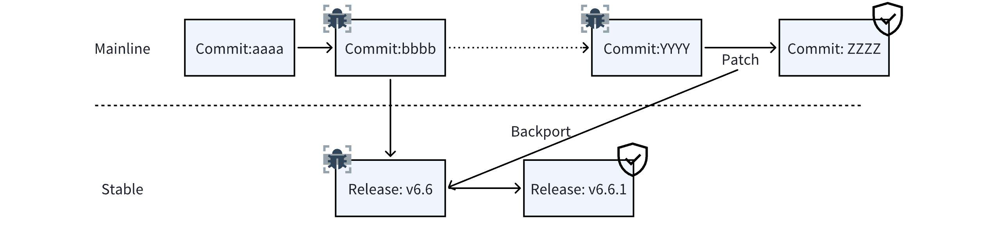
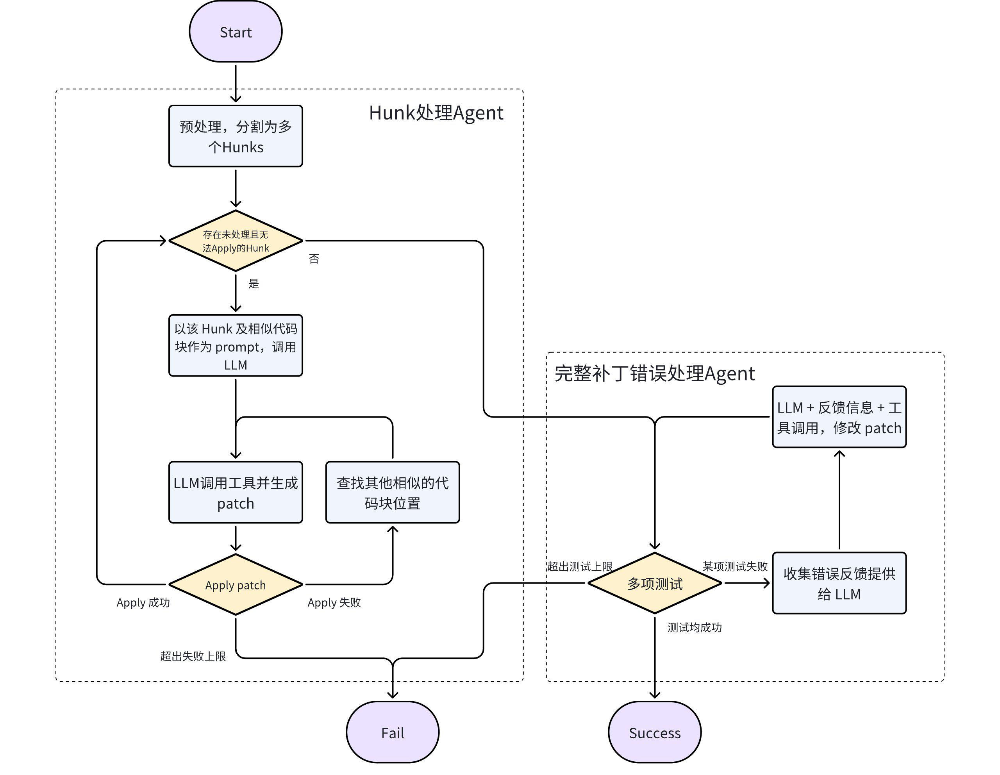
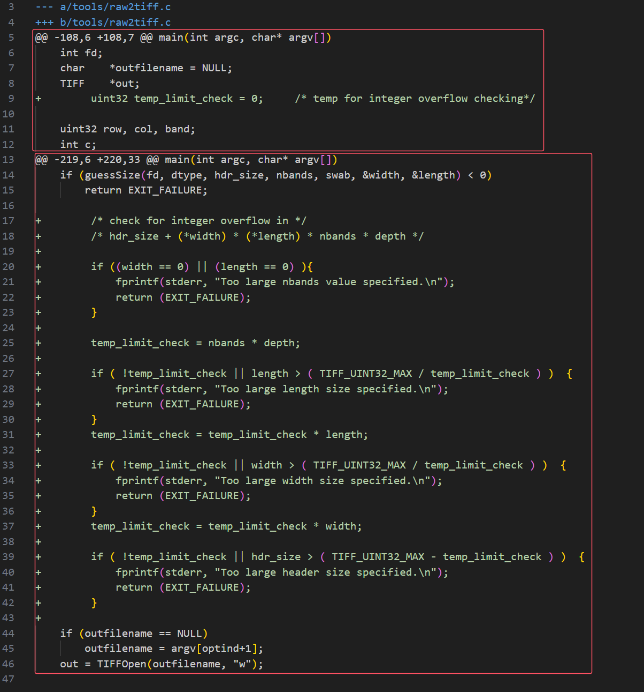
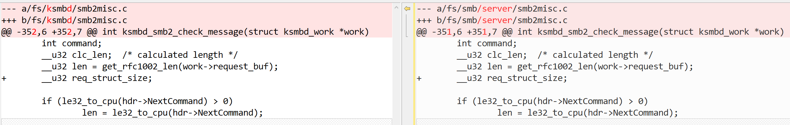
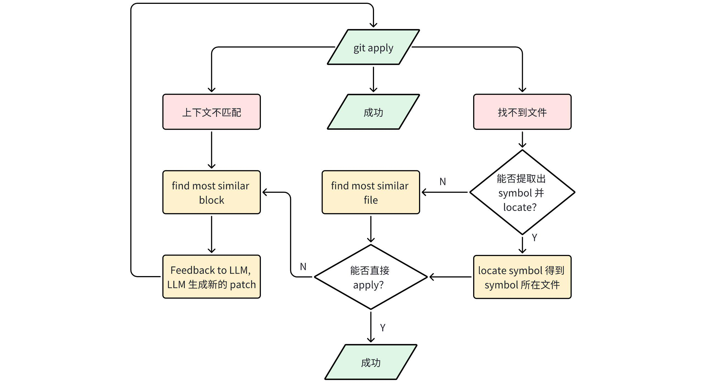

[](./Design.md)

# 设计文档

## 一、系统整体架构

对于同时维护多个版本的大型项目，在面对安全漏洞时往往都会在补丁后向迁移时遇到问题。当开发者尝试在主线版本中修复一个安全漏洞时，其同时维护的稳定版本(如下图 v6.6)也同样面临着安全漏洞带来的风险。但主线中的补丁后向迁移到稳定版本时常常无法直接迁移，需要人为干预，这也会导致 Stable 版本的安全漏洞会暴露更长时间从而带来安全风险。

而在人工 backport 的过程中，开发者需要根据自动迁移时的报错信息（如 cherry-pick 时的 conflict ）处理存在的冲突，使补丁可以成功合并。在这个过程中需要开发者完成如下的部分操作：

- 确认补丁中存在冲突的 hunk，并分别处理
- 找到 hunk 中上下文在 Stable 版本的位置
- 对于可能被迁移的文件，找到在版本推进时文件被移动的位置
- 解决 hunk 中上下文的冲突，将其合并
- 完成全部 hunk 迁移后，进行编译、PoC 等测试，持续修复至全部测试通过

因此，本项目尝试通过模拟开发者人工处理的过程，将 backport 的任务交给大模型处理，并通过 Agent 为大模型提供 tools 供其查阅所需信息，并在本地进行信息处理，使之获得与开发者 backport 过程中相似的能力。为了系统整体架构被分为了两个 Agent 处理与大模型间的任务与对话，分别对应下图中的 Hunk 处理 Agent与完整补丁错误处理 Agent。

- Hunk 处理 Agent：该代理会对补丁进行预处理，将其分割为多个 hunks 分别测试。将无法迁移的 hunk 交给大模型进行处理，此时大模型会不断调用 Agent 提供的工具，指导 hunk 可以成功迁移。
- 完整补丁错误处理 Agent：当完整补丁迁移成功后，在验证链的测试中一旦出现问题，则会调用这个 Agent 进行错误处理，类似的编译错误在这里会得到解决。



## 二、补丁预处理与定位

### 1. 补丁切分

在现实世界中，安全补丁从小到大，短则几行长则数千行，想要一次性的将上千行的补丁成功迁移，不论是从开发者的角度还是大模型来讲都是不现实的，因为补丁中往往所需要关注修改的细节太多。

因此我们尝试将补丁切分，将每次的修复集中在某一小部分上。而在现在的补丁格式中，其最小的划分单位为 hunk，一个补丁可能由多个 hunk 组成，hunk 之间互不冲突。如下图为 libtiff CVE-2023-41175 的修复补丁，其由图中标出的两个 hunk 组成，互不冲突。因此，在尝试使用大模型进行 backport 时，可以将补丁切分为单个 hunk 进行处理，首先尝试将 hunk 直接打入，失败后再交由大模型处理。

通过补丁切分，既模拟了开发者手工 backport 的处理过程，也可以尽可能地避免大模型上下文过长导致的问题。与此同时，直接打入的 hunk 不需要大模型处理，也可以减少调用大模型的轮数。

### 2. 文件移动处理

在 patch 的工作流程中，它会找到补丁所指向的文件，并在文件里找到一致上下文的代码块进行修改。但随着版本的变迁，有些文件会由于版本的更替移动位置或更改命名。

如上图为 Linux 中 CVE-2023-38432 在 v5.15（左）和 mainline（右）上分别应用的部分补丁。可以看到补丁中上下文和修改并无差别，但由于文件所在目录的移动使得 patch 工具无法成功迁移。同样的，我们尝试将补丁交由大模型处理时，它也无法在现有信息中推测出文件现在位置。

为了帮助大模型定位文件，本项目注意到尽管文件发生移动，但补丁中上下文存在的 symbol 往往是存在没有变化的。因此通过定位 symbol 所存在的位置，将其标记为潜在的目标文件并尝试应用补丁：

- 对于成功应用补丁的情况，我们可以认为这就是就版本中目标文件存在的位置并告知大模型。
- 而由于上下文潜在的变动，补丁应用也可能失败，在此时则将潜在的目标文件集合交由大模型处理。
- 若上下文中无可用的 symbol 进行定位，这种情况将在相似代码块匹配一节处理。

### 3. 相似代码块匹配

在一个补丁中，以` `或`-`作为开头的行数我们将其称为补丁上下文，patch 工具会在对应文件中找到完全一致的上下文位置进行修改，其中上下文存在任何差别都会导致失败。

为了尽快使大模型定位到上下文变化的代码块，本项目通过计算与补丁上下文的编辑距离，将最小编辑距离的代码块标记为相似代码块供大模型定位。除此之外，在每次大模型提供需要验证的补丁时，若补丁应用失败，通过相似代码块的匹配也可以为大模型提供具体的失败原因。

当然，在相似代码块匹配时依赖补丁中的文件名，若文件不存在且文件移动处理也未能定位其具体位置，在这里也会进行相似文件名的匹配。同样通过计算代码仓中全部文件与补丁文件名的编辑距离，将编辑距离最小的五个文件作为潜在目标文件集合，并对五个文件分别进行相似代码块匹配，取最小编辑距离作为相似代码块并和文件名一起反馈给大模型。

### 4. Apply hunk的失败反馈


git apply 共有 3 种失败情况：

1. 上下文不匹配，即补丁文件中以` `和`-`开头的行在 stable 版本目标文件中找不到。
2. 文件不存在，即被打补丁的目标文件在 stable 版本的仓库中不存在。
3. 格式错误，大多数表现为补丁文件中存在不以`+`,`-`或者` `开头的行。

其中情况 1, 2 的处理方式如上述流程图所示：

- 上下文不匹配：首先调用 find_most_similar_block 函数在 stabke 版本的目标文件中查找和 Mainline 补丁上下文最相似的块，并将该块与大模型产生的补丁的上下文逐行对比，将不一致的行反馈给大模型，使其产生新的补丁并保持与 stable 版本目标文件的上下文一致。
- 文件不存在：调用 _apply_file_move_handling 函数处理。该函数的目标是：找到目标代码块在 stable 版本中的哪个位置。有两种方法完成该目标：
  - (1) 尝试从 Mainline 补丁中提取符号，接着调用 locate_symbol 函数得到 symbol 在 stable 版本中的文件位置。如以下两个例子，分别可以提取出 ksmbd_transport_ops 和 stop_sessions 符号。
  - (2) 根据文件名找到 stable 版本仓库中最相似的若干文件。找到可能的目标文件后，即可尝试向目标文件 apply 补丁。出现上下文不匹配的问题时，将可能的目标文件路径和不匹配的上下文信息一起反馈给大模型。

      ```C
      @@ -135,7 +135,6 @@ struct ksmbd_transport_ops {
      @@ -416,13 +416,7 @@ static void stop_sessions(void)
      ```

- 格式错误：从 git apply 的错误信息提取出存在格式问题的行号，将该行号反馈给大模型并指出这个补丁存在格式问题。

## 三、Agent功能设计

### 1. Agent工具集

- viewcode
大模型可以通过该工具查看指定 commit 中指定文件的指定行。

    ```Python
        def _viewcode(self, ref: str, path: str, startline: int, endline: int) -> str:
            """
            View a file from a specific ref of the target repository. Lines between startline and endline are shown.

            Args:
                ref (str): The specific ref of the target repository.
                path (str): The path of the file to view.
                startline (int): The starting line number to display.
                endline (int): The ending line number to display.

            Returns:
                str: The content of the file between the specified startline and endline.
                    If the file doesn't exist in the commit, a message indicating that is returned.
            """
    ```

- locate_symbol
大模型可以通过该工具获得指定符号在指定 commit 的位置。该工具通过 ctags 实现。

    ```Python
        def _locate_symbol(self, ref: str, symbol: str) -> List[Tuple[str, int]] | None:
            """
            Locate a symbol in a specific ref of the target repository.

            Args:
                ref (str): The reference of the target repository.
                symbol (str): The symbol to locate.

            Returns:
                List[Tuple[str, int]] | None: File path and code lines.
            """
    ```

- validate
大模型可以通过该工具验证补丁的正确性。对于 hunk 处理 agent，该工具会检查大模型提供的 hunk 能否 apply，可以则视为验证通过，否则向大模型反馈错误信息。

    ```Python
        def _validate(self, ref: str, patch: str) -> str:
            """
            Validates a patch by using the `_compile_patch`, `_run_testcase`, and `_run_poc` methods.

            Args:
                ref (str): The reference string.
                patch (str): The patch string.

            Returns:
                str: The validation result.
            """
    ```

### 2. 生成补丁验证链

对于完整补丁错误处理 agent，validate 工具会检查大模型提供的完整补丁能否编译、通过 testcase 测试以及通过 PoC 测试。这一步骤需要用户准备好编译脚本、testcase 测试脚本和 PoC 测试脚本，如果某个环节没有脚本，则直接认为测试通过。

对于编译测试，工具首先将之前成功的所有 hunks 合并为一个完整补丁并尝试 apply。由于每一个 hunk 都已经通过 git apply 测试，因此这一步骤只可能出现补丁上下文不匹配的错误。如果出现错误，则按照前文所述的逻辑将上下文不匹配的行反馈给大模型，使其重新生成完整补丁。可以成功 apply 完整补丁后，执行准备好的编译脚本编译打补丁后的代码。如果编译成功则继续 testcase 测试，如果编译失败则将错误提示信息反馈给大模型，使其重新生成完整补丁。

对于 testcase 测试，工具执行准备好的 testcase 测试脚本。如果测试成功则继续 PoC 测试，如果测试失败则将错误提示信息反馈给大模型，使其重新生成完整补丁。

对于 PoC 测试，工具执行准备好的 PoC 测试脚本。如果测试成功则大模型生成的完整补丁通过了所有测试，如果测试失败则将错误提示信息反馈给大模型，使其重新生成完整补丁。
